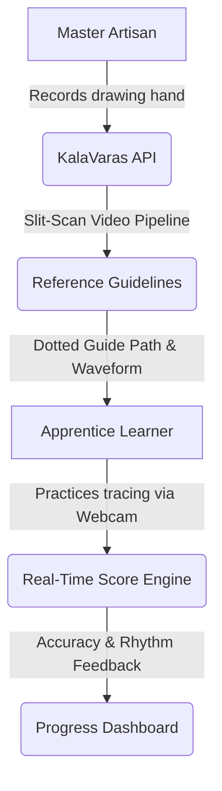

# कलावारस — KalaVaras
### **Folk Art Motor Memory Platform**

> [!NOTE]
> Preserving the invisible, embodied knowledge of traditional Indian brush and hand movements in Maharashtra.

KalaVaras ("Art Heir" in Marathi) is a bilingual digital platform designed to capture the motor memory of master artisans in traditional folk art styles—specifically **Warli**, **Kolam**, **Pichwai**, and **Madhubani**—and transfer that knowledge to young apprentices through interactive canvas tracing, real-time video analysis, and structured practice.

---

## 📂 The Problem It Solves

Traditional art preservation typically focuses on archiving finished paintings, which leaves a significant gap in documenting the actual technique.

1. **The Documentation Gap**: Existing archives preserve static imagery of finished art but fail to capture the step-by-step motor memory (the pressure, rhythm, angles, and trajectory of the brush) that goes into creating it.
2. **The Technology Gap**: Professional motion capture setup is too expensive, complex, and inaccessible in rural communities. 
3. **The Pedagogy Gap**: Apprentices in villages often learn from low-resolution videos shared on WhatsApp, which lacks slow-motion, angle-specific, or rhythmic learning feedback. This results in the gradual loss of stylistic nuances across generations.

---

## 🎨 What KalaVaras Does

KalaVaras sits between traditional master artisans and young apprentices to create an end-to-end learning environment:



1. **Capture**: A master artisan records their hand drawing a specific motif (a "Stroke Card") on their device.
2. **Analyze**: The backend processes the video to create a horizontal slit-scan time-composite image and a rhythm waveform profile, mapping exactly how the brush moved.
3. **Practice**: Apprentice learners trace over these templates in real-time, matching the speed, direction, and shape of the master's hand.

---

## ✨ Key Features

### 1. Interactive Tracing Canvas
- **Webcam Integration**: Apprentice draws directly over a live feed of their hand (webcam) or a clean drawing slate.
- **Dynamic Guidelines (Ghost Paths)**: Dotted guides are dynamically rendered depending on the card selected (e.g., Warli triangles, Pichwai lotus petals, or Archimedean spirals).
- **Teal Brush Feedback**: Displays the user’s real-time stroke trail on top of the webcam feed.

### 2. Live Evaluation Engine
- **Accuracy Matcher**: Evaluates the mathematical distance deviation between the learner's drawing and the guide shape.
- **Rhythm Analyzer**: Evaluates the standard deviation of drawing speed to ensure smooth, continuous, and rhythmic brush control.

### 3. Dual-Role Architecture
- **Artisan Mode**: One-tap creation of Stroke Cards. Artisans write descriptions in Marathi/English, assign difficulty ratings, set visibility options (Public, Community, or Private), and publish them.
- **Learner Mode**: Interactive practice, library search, and self-evaluation dashboards.

### 4. Progress Dashboard & Streaks
- Tracks daily practice streaks to build learning consistency.
- Displays line charts showing accuracy and rhythm improvements over time.

---

## ⚡ How It Is Helpful & Impact Created

### For Master Artisans
- **Heritage Preservation**: Provides a free, dignified way to immortalize their stylistic variations and lineage.
- **Content Ownership**: Enforces strict role-based access checks (RBAC) so that artisans retain complete ownership of the digital representations of their art.

### For Apprentices
- **Self-Guided Learning**: Provides instant pedagogical feedback (Accuracy and Rhythm percentages) without needing constant physical supervision.
- **Low-Cost Access**: Optimized to load in under 4 seconds on low-end Android mobile devices over 3G networks, ensuring it works in remote villages.

### For Academics & NGOs
- **Lineage Graphs**: Visualizes how different styles and motifs relate across traditions.
- **Research Data**: Supports structured data exports containing provenance and citation tags.

---

## 🛠️ Technical Architecture & Setup

### Repository Structure
```
d:/FENIL/PROJECT 1/
├── apps/
│   ├── web/          # React 18 SPA (Vite + Tailwind CSS + i18next)
│   └── api/          # Node.js 20 + Express 5 + Drizzle/PGLite
├── services/
│   └── slit-scan/    # Python 3.11 + Flask + FFmpeg (Slit-scan engine)
└── .tmp/
    └── pglite_db/    # Persistent local SQLite folder (Dev mode)
```

### Quick Start (Local Development)

#### 1. Configure the Environment
Copy the example environment file and set up your variables:
```bash
cp .env.example .env
```
*Note: Set `USE_LOCAL_MOCKS=true` to test the application locally without requiring external PostgreSQL, Redis, or Docker services.*

#### 2. Install Dependencies
```bash
npm install
```

#### 3. Run the Backend API
```bash
cd apps/api
npm run dev
# Starts backend server on http://localhost:4000
```

#### 4. Run the Frontend Web App
```bash
cd apps/web
npm run dev
# Starts Vite server on http://localhost:5173 (or 5174 if busy)
```

---

## 🔒 Security Design
- **JWT Auth**: Session access tokens are kept in-memory (Zod-validated) and refresh tokens reside in secure `httpOnly` cookies.
- **CORS Protection**: Dynamically allows any local port (5173, 5174, etc.) in development, while locking down strictly to the production `FRONTEND_URL` in production.
- **Database Parameterization**: Zero raw SQL interpolation—all queries are parameterized using Drizzle ORM to block SQL Injection.
